<p align="center">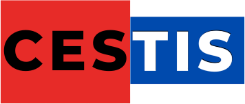</p>

# C.E.S.T.I.S Office

**C.E.S.T.I.S TECHNICAL SERVICES**: a cartoon 3D office where a team of AI coding agents works through your GitHub issues. Walk the floors in first person, look over their shoulders at their live terminals, and watch their pull requests get tested and merged.

Every person you hire gets a **C.E.S.T.I.S staff shirt** in one of twelve colours, with the logo on the chest and the company name across the back, plus a **name badge** showing their role.

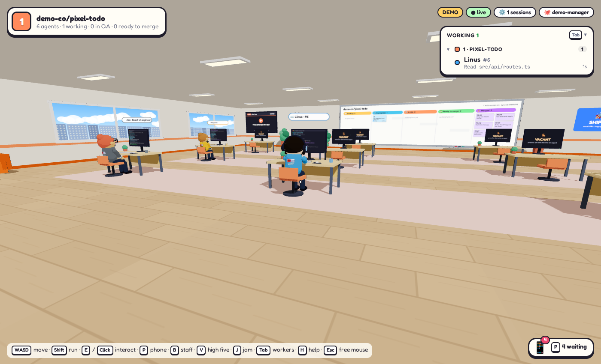

## What's in this version

C.E.S.T.I.S Office is built on [cubefarm](https://github.com/leonvanzyl/cubefarm) by Leon van Zyl (MIT licence). It works the same way and adds:

| | |
| --- | --- |
| 🏢 **C.E.S.T.I.S branding** | Logo and company name on the start screen, setup wizard, lobby sign, HUD, favicon and browser tab |
| 👕 **Staff uniforms** | Each hire gets a polo shirt from the staff range (CESTIS Red, CESTIS Blue, Crisp White, Midnight Black, Sunshine Gold, Island Green and more), with a contrast collar, a chest logo and *C.E.S.T.I.S TECHNICAL SERVICES* across the back. Candidates in the waiting room still wear their own clothes, because the shirt comes with the job |
| 🪪 **Name badges** | A clip-on badge on every shirt with the person's name, role (Software Developer, QA Tester, Chief Executive Officer or their specialist title) and a staff number |
| 😄 **More cartoonish characters** | Bigger heads, big eyes with pupils and shines, blinking, eyebrows that move with their mood, rosy cheeks, mitten hands, chunky shoes, an open-mouth cheer and a happy bounce |
| 🪪 **Staff ID cards** | Look at anyone and their ID card pops up beside the crosshair, showing their role, shirt, status, what they're working on and how many PRs they've helped merge |
| ✋ **High fives** | Press **V** while looking at someone: they throw their arms up and shout back ("Big up!", "Irie!", "Respect!"…) |
| 👕 **Change shirts** | Press **C** to give someone the next shirt in the range, or pick any colour in the staff room. Changes are saved for everyone |
| 👥 **Staff room** | Press **B** (or use the Employee of the Month board in the lobby) to see every ID card by floor, with shirt pickers and high-five buttons |
| 🏆 **Employee of the Month** | A framed board in the lobby for whoever has helped get the most pull requests merged |
| 🎉 **Office jam and confetti** | Press **J** for confetti, and everyone on the floor jumps up and cheers. Every merged pull request sets off confetti and a banner by itself |
| 🔤 **Works offline** | Fonts are bundled with the app instead of loaded from Google |

## Screenshots

| | |
| --- | --- |
| 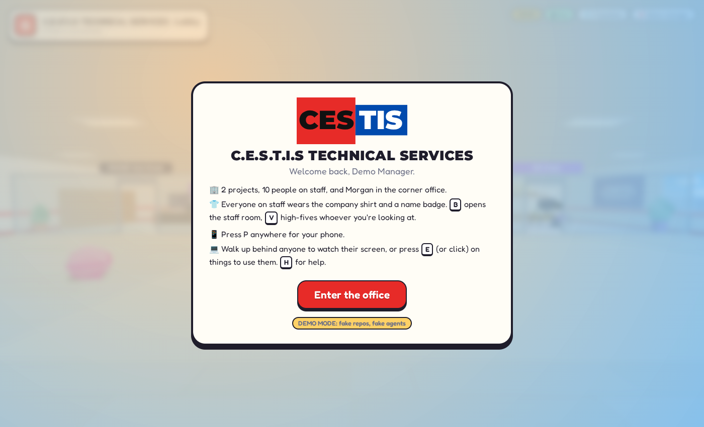 | 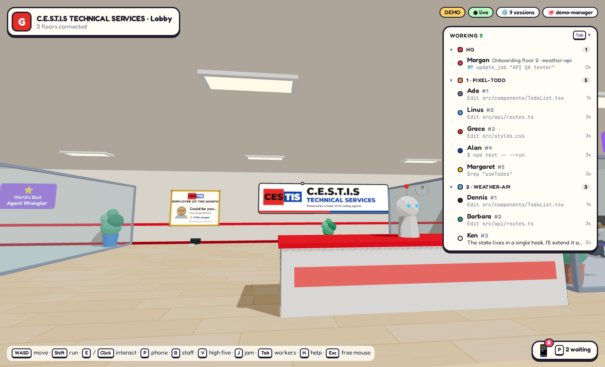 |
| Start screen | Lobby, with the logo sign and the Employee of the Month |
| 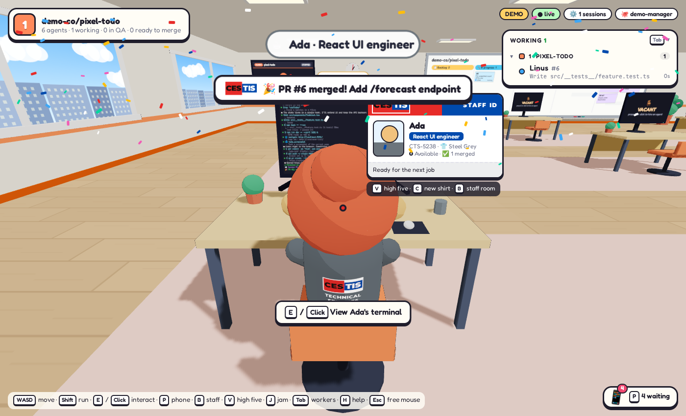 | 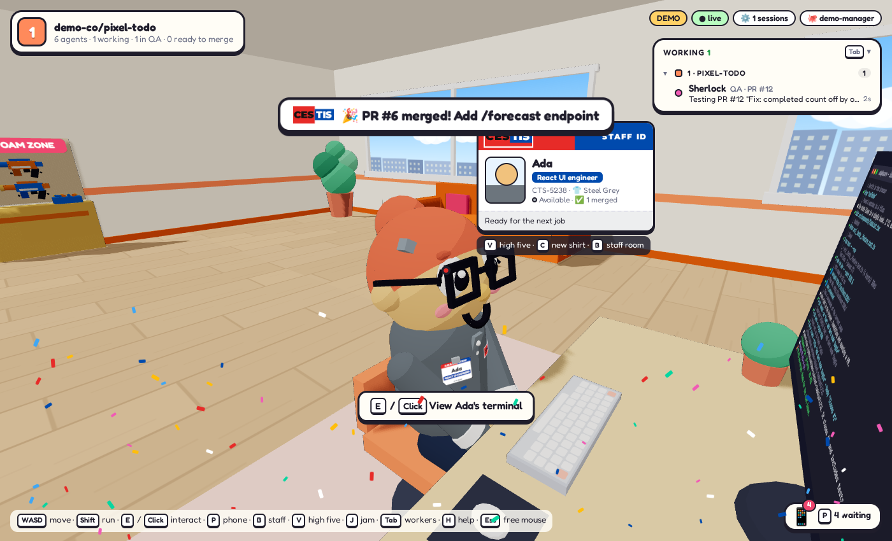 |
| The back of the staff shirt | Look at someone to see their staff ID card and name badge |
| 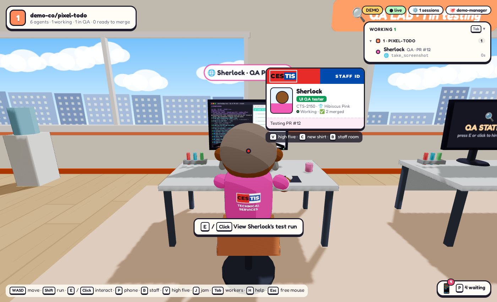 | 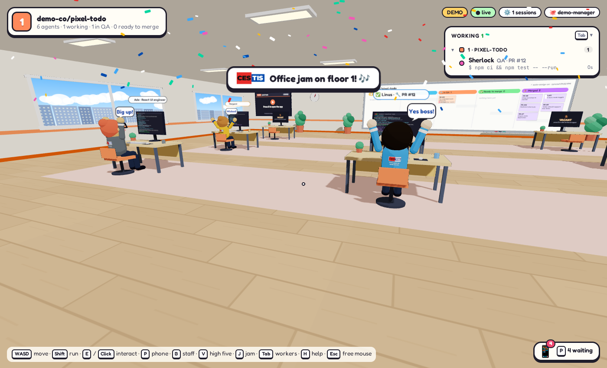 |
| QA testers wear the uniform too | Office jam: confetti and cheers |
| 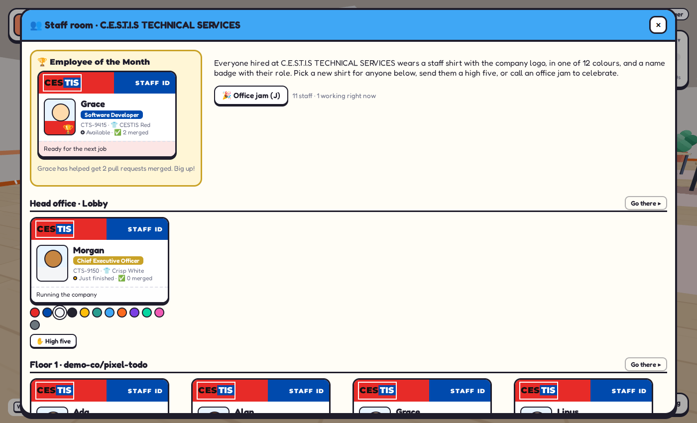 | 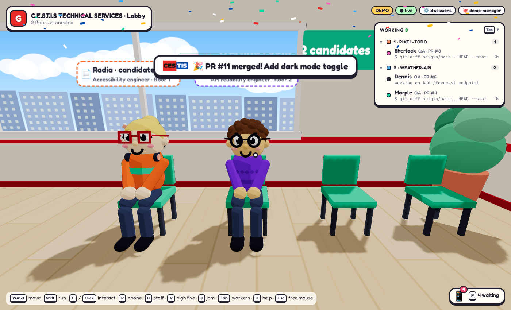 |
| The staff room (B) | Candidates wait in their own clothes until they're hired |
| 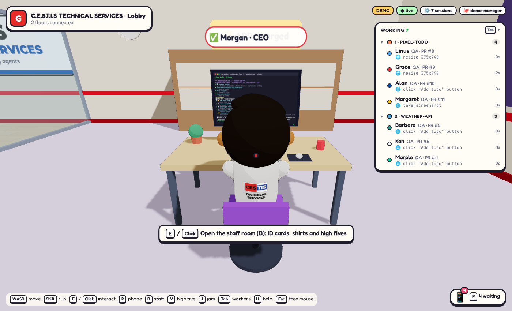 | 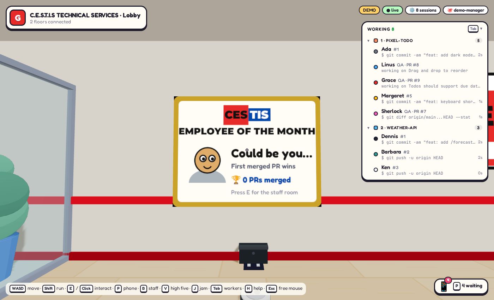 |
| The CEO in their staff shirt | Employee of the Month |

## Get started

### What you need

- **Node.js 22 or newer**: [nodejs.org](https://nodejs.org)
- **git**
- **The GitHub CLI**, signed in: install it from [cli.github.com](https://cli.github.com), then run `gh auth login`
- **A Claude subscription** for Claude Code, which runs the agents and the CEO. You don't need to install Claude Code separately: it comes with the app. Agents can also run Codex or OpenCode if you have them installed and signed in.
- **Google Chrome**, for agents that test your app in a browser

It runs on Windows, macOS and Linux.

### Run it

```bash
git clone https://github.com/YOUR-USERNAME/cestis-office.git
cd cestis-office
npm install
npm run build
```

**Try the demo first.** It fakes GitHub and the agents, so it costs nothing and changes nothing:

```bash
npm run demo
```

Then open http://localhost:5317.

**Run it for real** with your Claude subscription and your GitHub repos:

```bash
node bin/cestis-office.js login     # sign Claude Code in, once
node bin/cestis-office.js doctor    # check this machine is ready
npm start                           # start the office and open it in your browser
```

To get the short command `cestis-office` anywhere on your machine, run `npm link` once in this folder. Then you can use `cestis-office`, `cestis-office --demo`, `cestis-office doctor` and `cestis-office login`.

## Your first five minutes

1. **Set up your company.** A short wizard asks your name, fills in C.E.S.T.I.S TECHNICAL SERVICES as the company name, and introduces your CEO. You choose the CEO's staff shirt colour.
2. **Move in a project.** Pick one of your project folders or a GitHub repo, or start a new blank repo. Each project gets its own floor. Every project needs to be on GitHub, because issues and pull requests are how the team works.
3. **Let the CEO plan.** The CEO studies the project, writes its QA checklist, plans the work as GitHub issues and proposes who to hire. Press `P` for your phone to chat with them and approve hires. New hires get their staff shirt and badge.
4. **Watch the work.** Developers pick up issues and open pull requests. QA testers review and test each one in a real browser, then post a report with screenshots. With auto-merge on, a pull request merges once QA passes and GitHub's checks are green, and the office celebrates.

## Controls

| Key | Action |
| --- | --- |
| `W A S D` / arrows | walk |
| `Shift` | run |
| mouse | look around (click the view first) |
| `E` / click | use what you're looking at: a desk, the whiteboard, the elevator, the manager's computer |
| `V` | high five the person you're looking at |
| `C` | change their staff shirt colour |
| `B` | staff room: ID cards, shirts, Employee of the Month |
| `J` | office jam: confetti, and everyone cheers |
| `P` | your phone |
| `Tab` | show or hide the "who's working" list |
| `H` | help |
| `M` | sound on or off |
| `Esc` | let go of the mouse, or close a panel |

## What's in the office

- **Floors**: one per GitHub repo. Ride the elevator between them.
- **Desks**: walk up behind an agent to watch their laptop. Open it to see their real terminal: every agent is an actual coding agent running on your machine, and you can type into it. It also shows a live browser when they test the UI.
- **The QA lab**: every floor has at least one QA tester.
- **The whiteboard**: the Kanban board, from backlog to merged. File issues, assign them, and merge pull requests from here.
- **The lobby**: the manager's office (connect repos, create new blank repos, hire, file issues and change settings), the CEO's corner office, the waiting room, the trophy cabinet and the Employee of the Month.

## Put it on your own GitHub

1. Create an empty repository on GitHub called `cestis-office`. Don't add a README, licence or .gitignore, because this repo already has them. Or run `gh repo create cestis-office --private`.
2. In this folder, run:

   ```bash
   git remote add origin https://github.com/YOUR-USERNAME/cestis-office.git
   git branch -M main
   git push -u origin main
   ```

3. GitHub Actions (`.github/workflows/ci.yml`) will type-check, test and build every push and pull request on Ubuntu and Windows.

To make changes and improve it further, see [CONTRIBUTING.md](CONTRIBUTING.md). [CLAUDE.md](CLAUDE.md) tells Claude Code how the codebase fits together, so you can point Claude Code (or the office's own agents) at this repo and have them build new features for you.

## Good to know

- **It runs on your coding agents' subscriptions.** Agents on the same coding agent share the same usage limits. To cap how many work at once, set a session limit in the manager's console.
- **Agents work on your machine, like your own coding agents**: with your skills, MCP servers and settings, each in its own copy of the repo. They don't push to your main branch or merge. The office merges, after QA.
- **Your office lives in `~/.cestis-office`**: settings, clones of your repos and one working copy per agent. Set `SWARM_HOME` to use another folder.

## Learn more

- [How it works](docs/how-it-works.md): the life of an issue, QA, auto-merge, models and usage, the safety model and floor previews
- [Contributing](CONTRIBUTING.md): run it from source, tests, architecture

## Credits and licence

C.E.S.T.I.S Office is a modified version of [cubefarm](https://github.com/leonvanzyl/cubefarm) © 2026 Leon van Zyl, used under the MIT licence. The modifications are © 2026 C.E.S.T.I.S Technical Services. See [LICENSE](LICENSE).
